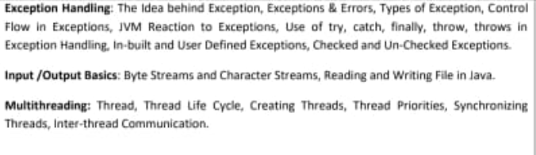

## Java Notes

### Unit 1

#### Introduction (First Part)

- Why Java
- History of Java
- JVM (Java Virtual Machine)
- JRE (Java Runtime Environment)
- Java Environment
- Java Source File Structure
- Compilation

#### Fundamental Concepts in Java

- Programming Structures in Java
  - Defining classes in Java
  - Constructors
  - Methods
  - Access Specifiers
  - Static Members
  - Final Members
  - Comments
  - Data types
  - Variables
  - Operators
  - Control Flow
  - Arrays & Strings

#### Object-Oriented Programming

- Class
- Object
- Inheritance
  - Superclass
  - Subclass
- Overriding
- Overloading
- Encapsulation
- Polymorphism
- Abstraction
- Interfaces
- Abstract Class

#### Packages

- Defining Packages
- CLASSPATH Setting for Packages
- Making JAR Files for Library Packages
- Import and Static Import Naming Convention For Packages

## Introduction

### Java
Java is a high-level, object-oriented programming language developed by Sun Microsystems (now owned by Oracle) in the mid-1990s. It is known for its platform independence and robustness.

### History of Java
Java was created by James Gosling at Sun Microsystems and released in 1995. It was designed to be portable, secure, and easy to use for developing a wide range of applications.

### JVM (Java Virtual Machine)
JVM is an abstract computing machine that provides the runtime environment for Java bytecode to be executed. It translates Java bytecode into native machine code and handles memory management, garbage collection, and other runtime tasks.

### JRE (Java Runtime Environment)
JRE is a software package that includes JVM, Java libraries, and other necessary components to run Java applications. It does not include development tools like compilers.

### Java Environment
Java Environment refers to the complete setup required for Java development and execution, including JDK (Java Development Kit), IDEs (Integrated Development Environments), and runtime environments like JRE or JVM.

### Java Source File Structure
A Java source file typically consists of a single public class and other supporting non-public classes. It includes package declarations, import statements, class declarations, fields, methods, and other elements according to Java syntax rules.

### Compilation
Compilation is the process of converting human-readable Java source code into platform-independent bytecode using a Java compiler (e.g., `javac`). This bytecode can then be executed by the JVM on any platform that supports Java.

## Fundamental Concepts in Java

### Defining Classes in Java
Classes in Java are blueprints for objects. They define attributes (fields) and behaviors (methods) that objects of that class will have.

```java
// Example of defining a class
public class MyClass {
    // Fields (attributes)
    int myField;

    // Methods (behaviors)
    void myMethod() {
        System.out.println("This is a method in MyClass");
    }
}
```

### Constructors
Constructors are special methods used to initialize objects when they are created. They have the same name as the class and do not have a return type.

```java
// Example of a constructor
public class MyClass {
    int myField;

    // Constructor
    public MyClass(int value) {
        myField = value;
    }
}
```

### Methods
Methods are functions defined inside a class that perform specific tasks or operations.

```java
// Example of a method
public class MyClass {
    void myMethod() {
        System.out.println("This is myMethod");
    }
}
```

### Access Specifiers
Access specifiers control the visibility of classes, fields, and methods in Java. There are four access specifiers: `public`, `private`, `protected`, and default (no specifier).

```java
// Example of access specifiers
public class MyClass {
    public int publicField;
    private int privateField;
    protected int protectedField;
    int defaultField; // Default access
}
```

### Static Members
Static members (fields or methods) belong to the class itself rather than any specific instance of the class. They are accessed using the class name.

```java
// Example of static member
public class MyClass {
    static int staticField;
    static void staticMethod() {
        System.out.println("This is a static method");
    }
}
```

### Final Members
Final members (fields or methods) cannot be changed once initialized (for fields) or defined (for methods).

```java
// Example of final member
public class MyClass {
    final int finalField = 10;
    final void finalMethod() {
        System.out.println("This is a final method");
    }
}
```

### Comments
Comments are used to add explanations or documentation to the code and are ignored by the compiler.

```java
// This is a single-line comment

/*
 * This is a
 * multi-line comment
 */
public class MyClass {
    // This is an inline comment
}
```

### Data Types and Variables
Java has several data types such as `int`, `double`, `boolean`, etc., used to define variables.

```java
// Example of data types and variables
public class MyClass {
    int number = 5; // Integer variable
    double pi = 3.14; // Double variable
    boolean isTrue = true; // Boolean variable
    String text = "Hello"; // String variable
}
```

### Operators
Java supports various operators like arithmetic, relational, logical, etc., used to perform operations on variables and values.

```java
// Example of operators
public class MyClass {
    int a = 5;
    int b = 3;
    int sum = a + b; // Addition operator
    boolean isGreaterThan = a > b; // Relational operator
    boolean logicalAnd = true && false; // Logical AND operator
}
```

### Control Flow
Control flow statements such as `if-else`, `switch`, `for`, `while`, etc., control the flow of execution in Java programs.

```java
// Example of control flow
public class MyClass {
    void checkNumber(int num) {
        if (num > 0) {
            System.out.println("Positive");
        } else if (num < 0) {
            System.out.println("Negative");
        } else {
            System.out.println("Zero");
        }
    }
}
```

### Arrays & Strings
Arrays store multiple values of the same data type, and strings represent sequences of characters in Java.

```java
// Example of arrays and strings
public class MyClass {
    // Array
    int[] numbers = {1, 2, 3, 4, 5};

    // String
    String text = "Hello, Java!";
}
```

## Object-Oriented Programming

### Class
A class is a blueprint or template for creating objects. It defines the properties and behaviors that an object of that class will have.

```java
// Example of defining a class
public class MyClass {
    // Fields (attributes)
    int myField;
}
```

### Object
An object is an instance of a class. It contains the state and behavior of the class.

```java
// Example of creating an object
public class MyClass {
    public static void main(String[] args) {
        // Creating an object of MyClass
        MyClass myObject = new MyClass();
        
        // Calling the method of the object
        myObject.myMethod();
    }
    
    int myField;
    void myMethod() {
        System.out.println("This is myMethod");
    }
}
```

### Inheritance
Inheritance is a mechanism in object-oriented programming that allows one class to inherit the properties and behaviors of another class.

```java
// Example of inheritance
public class MyParentClass {
    int myField;
    void myMethod() {
        System.out.println("This is myMethod");
    }
}

class MyChildClass extends MyParentClass {
    // This class inherits all the properties and methods of MyParentClass
    // and we can define new properties and methods in this class
    int myChildField;
    void myChildMethod() {
        // call the method of the parent class
        super.myMethod();
        System.out.println("This is myChildMethod");
    }
}
```

#### Superclass and Subclass
Superclass is the class that is inherited from, and subclass is the class that inherits from the superclass.

```java
// Example of superclass and subclass
public class MyParentClass {
    int myField;
    void myMethod() {
        System.out.println("This is myMethod");
    }
}

class MyChildClass extends MyParentClass {
    // This class inherits all the properties and methods of MyParentClass
    // and we can define new properties and methods in this class
    int myChildField;
    void myChildMethod() {
        // call the method of the parent class
        super.myMethod();
        System.out.println("This is myChildMethod");
    }
    public static void main(String[] args) {
        MyChildClass myObject = new MyChildClass();
        myObject.myMethod();
        myObject.myChildMethod();
    }
}
```

#### Overriding
Overriding occurs when a subclass provides a specific implementation of a method that is already defined in its superclass. This allows for runtime polymorphism, where the method that gets executed is determined at runtime based on the object's type.

**Parent obj = new Child();**

This is also known as Upsitting


### Runtime / Dyanmic Polymorphism

*What is dynamic Method overlaoding*

**Dynamic runtime dispatched**

It's a mechanism to a call to a overridden method is resolved at runtime rather than a compile time

That's why the name is Dyanmic Polymorphism


```java
class Animal {
    void makeSound() {
        System.out.println("Animal sound");
    }
}

class Dog extends Animal {
    @Override
    void makeSound() {
        System.out.println("Bark");
    }
}

public class Main {
    public static void main(String[] args)

 {
        Animal myAnimal = new Dog();
        myAnimal.makeSound(); // Output: Bark
    }
}
```

#### Overloading
Overloading occurs when two or more methods in the same class have the same name but different parameters (number, type, or both). Overloaded methods provide different ways to perform similar actions.

```java
class MathOperations {
    int add(int a, int b) {
        return a + b;
    }
    
    double add(double a, double b) {
        return a + b;
    }
    
    int add(int a, int b, int c) {
        return a + b + c;
    }
}

public class Main {
    public static void main(String[] args) {
        MathOperations math = new MathOperations();
        System.out.println(math.add(2, 3)); // Output: 5
        System.out.println(math.add(2.5, 3.5)); // Output: 6.0
        System.out.println(math.add(1, 2, 3)); // Output: 6
    }
}
```

### Encapsulation
Encapsulation is the practice of wrapping data (fields) and methods (behaviors) that operate on the data into a single unit or class. It is used to protect the internal state of an object and only allow controlled access through public methods.

```java
class Person {
    private String name;
    private int age;
    
    // Getter method for name
    public String getName() {
        return name;
    }
    
    // Setter method for name
    public void setName(String name) {
        this.name = name;
    }
    
    // Getter method for age
    public int getAge() {
        return age;
    }
    
    // Setter method for age
    public void setAge(int age) {
        if (age > 0) {
            this.age = age;
        }
    }
}

public class Main {
    public static void main(String[] args) {
        Person person = new Person();
        person.setName("John");
        person.setAge(25);
        System.out.println("Name: " + person.getName());
        System.out.println("Age: " + person.getAge());
    }
}
```

### Polymorphism
Polymorphism is the ability of an object to take on many forms. It allows one interface to be used for a general class of actions. The specific action is determined by the exact nature of the situation.

```java
class Animal {
    void makeSound() {
        System.out.println("Animal sound");
    }
}

class Dog extends Animal {
    @Override
    void makeSound() {
        System.out.println("Bark");
    }
}

class Cat extends Animal {
    @Override
    void makeSound() {
        System.out.println("Meow");
    }
}

public class Main {
    public static void main(String[] args) {
        Animal myDog = new Dog();
        Animal myCat = new Cat();
        
        myDog.makeSound(); // Output: Bark
        myCat.makeSound(); // Output: Meow
    }
}
```

### Abstraction
Abstraction is the concept of hiding the complex implementation details of a system and exposing only the necessary and relevant parts to the user. It can be achieved using abstract classes and interfaces.

```java
abstract class Animal {
    abstract void makeSound(); // Abstract method
}

class Dog extends Animal {
    @Override
    void makeSound() {
        System.out.println("Bark");
    }
}

public class Main {
    public static void main(String[] args) {
        Animal myDog = new Dog();
        myDog.makeSound(); // Output: Bark
    }
}
```

### Interfaces
Interfaces are used to achieve abstraction in Java. They define a contract that implementing classes must follow. An interface can contain abstract methods and static constants.

```java
interface Animal {
    void makeSound(); // Abstract method
}

class Dog implements Animal {
    @Override
    public void makeSound() {
        System.out.println("Bark");
    }
}

public class Main {
    public static void main(String[] args) {
        Animal myDog = new Dog();
        myDog.makeSound(); // Output: Bark
    }
}
```

### Abstract Class
An abstract class is a class that cannot be instantiated and is meant to be subclassed. It can have abstract methods (without implementation) as well as concrete methods (with implementation).

```java
abstract class Animal {
    abstract void makeSound(); // Abstract method
    
    void sleep() {
        System.out.println("Sleeping...");
    }
}

class Dog extends Animal {
    @Override
    void makeSound() {
        System.out.println("Bark");
    }
}

public class Main {
    public static void main(String[] args) {
        Animal myDog = new Dog();
        myDog.makeSound(); // Output: Bark
        myDog.sleep(); // Output: Sleeping...
    }
}
```

## Packages

### Defining Packages
Packages are used to group related classes and interfaces together. They help to avoid name conflicts and make it easier to manage large codebases.

```java
// Define a package
package com.example.myapp;

public class MyClass {
    // Class implementation
}
```

### CLASSPATH Setting for Packages
The `CLASSPATH` environment variable is used to specify the location of user-defined classes and packages. It tells the Java compiler and JVM where to look for classes.

### Making JAR Files for Library Packages
JAR (Java ARchive) files are used to package multiple Java classes, metadata, and resources into a single file for distribution.

```bash
# Create a JAR file
jar cvf mylibrary.jar com/example/myapp/*.class
```

### Import and Static Import Naming Convention For Packages
The `import` statement is used to include classes and packages into your code. The `static import` statement allows the static members of a class to be used without specifying the class name.

```java
// Import a package
import java.util.*;

// Import a specific class
import java.util.ArrayList;

// Static import
import static java.lang.Math.*;
```
# Unit 2

### Exception Handling

#### The Idea behind Exception
Exceptions are events that disrupt the normal flow of the program's instructions. They occur during runtime and signal errors or other exceptional conditions. Handling exceptions allows a program to continue execution or fail gracefully. Without proper exception handling, a program may crash or produce incorrect results. In Java, exceptions are objects that describe an exceptional condition.

```java
try {
    int result = 10 / 0; // This will throw an ArithmeticException
} catch (ArithmeticException e) {
    System.out.println("Cannot divide by zero.");
}
```

#### Exceptions & Errors
Exceptions are conditions that a program can reasonably handle, such as file not found or invalid input. Errors, on the other hand, are usually not recoverable and indicate serious problems, like OutOfMemoryError. Both are subclasses of Throwable, but errors are generally beyond the program's control. Handling exceptions properly can prevent crashes and unexpected behavior. Errors should be logged and monitored as they typically indicate critical issues.

```java
try {
    int[] arr = new int[5];
    System.out.println(arr[10]); // This will throw an ArrayIndexOutOfBoundsException
} catch (ArrayIndexOutOfBoundsException e) {
    System.out.println("Index out of bounds.");
}
```

#### Types of Exception
Exceptions in Java are broadly categorized into checked and unchecked exceptions. Checked exceptions must be either caught or declared in the method signature using throws. Unchecked exceptions, also known as runtime exceptions, do not need explicit handling. Common checked exceptions include IOException and SQLException. Unchecked exceptions include NullPointerException and ArithmeticException. Properly categorizing exceptions helps in writing robust and error-free code.

```java
try {
    FileReader file = new FileReader("nonexistentfile.txt"); // This will throw a FileNotFoundException
} catch (FileNotFoundException e) {
    System.out.println("File not found.");
}
```

#### Control Flow in Exceptions
Control flow in exception handling involves using try, catch, finally, throw, and throws. A try block is used to wrap code that might throw an exception. Catch blocks follow to handle specific exceptions. The finally block is optional and executes whether or not an exception is thrown. The throw keyword manually throws an exception, and throws is used in method signatures to declare possible exceptions. This structured approach ensures clean and manageable error handling.

```java
try {
    int num = Integer.parseInt("abc"); // This will throw a NumberFormatException
} catch (NumberFormatException e) {
    System.out.println("Invalid number format.");
} finally {
    System.out.println("This block always executes.");
}
```

#### JVM Reaction to Exceptions
When an exception occurs, the Java Virtual Machine (JVM) creates an exception object. This object contains details about the exception, including its type and state. The JVM then searches for a catch block to handle the exception. If no appropriate handler is found, the JVM terminates the program. Properly handled exceptions allow the JVM to continue execution, maintaining program stability and preventing abrupt terminations.

```java
public void method() throws IOException {
    FileReader file = new FileReader("nonexistentfile.txt");
}
try {
    method();
} catch (IOException e) {
    System.out.println("Caught IOException.");
}
```

#### Use of try, catch, finally, throw, throws in Exception Handling
The try block contains code that might throw an exception. The catch block handles the specific exception. Multiple catch blocks can handle different exceptions. The finally block executes regardless of whether an exception was thrown. The throw keyword manually throws an exception, while throws declares exceptions in a method signature. Together, these constructs provide a robust framework for handling exceptions.

```java
try {
    throw new Exception("This is a thrown exception.");
} catch (Exception e) {
    System.out.println(e.getMessage());
} finally {
    System.out.println("This block always executes.");
}
```

#### In-built and User Defined Exceptions
Java provides in-built exceptions such as NullPointerException and IOException. These are part of the Java API and cover common error conditions. User-defined exceptions extend the Exception class and provide custom error handling. They are useful for application-specific errors. By creating user-defined exceptions, developers can signal and handle unique error conditions in their applications.

```java
class CustomException extends Exception {
    public CustomException(String message) {
        super(message);
    }
}
try {
    throw new CustomException("Custom exception occurred.");
} catch (CustomException e) {
    System.out.println(e.getMessage());
}
```

#### Checked and Un-Checked Exceptions
Checked exceptions are checked at compile-time and must be either caught or declared using throws. Examples include IOException and SQLException. Unchecked exceptions, or runtime exceptions, are checked at runtime and include NullPointerException and ArithmeticException. They do not need explicit handling. Handling checked exceptions ensures that the code is prepared for possible error conditions, while unchecked exceptions often indicate programming errors.

```java
// Checked Exception
try {
    FileInputStream file = new FileInputStream("nonexistentfile.txt");
} catch (FileNotFoundException e) {
    System.out.println("File not found.");
}

// Unchecked Exception
int num = 10 / 0; // This will throw an ArithmeticException
```

### Input/Output Basics

#### Byte Streams and Character Streams
Byte streams handle I/O of raw binary data. They use InputStream and OutputStream classes. Character streams handle I/O of character data, and they use Reader and Writer classes. Byte streams are useful for binary files like images, while character streams are suitable for text files. Choosing the correct stream ensures efficient and appropriate data handling.

```java
// Byte Stream Example
try (FileInputStream in = new FileInputStream("input.txt");
     FileOutputStream out = new FileOutputStream("output.txt")) {
    int byteData;
    while ((byteData = in.read()) != -1) {
        out.write(byteData);
    }
}

// Character Stream Example
try (FileReader reader = new FileReader("input.txt");
     FileWriter writer = new FileWriter("output.txt")) {
    int charData;
    while ((charData = reader.read()) != -1) {
        writer.write(charData);
    }
}
```

#### Reading and Writing File in Java
Reading and writing files in Java involve using classes like FileReader, FileWriter, FileInputStream, and FileOutputStream. FileReader and FileWriter are used for character data, while FileInputStream and FileOutputStream handle binary data. Properly closing the streams is crucial to avoid resource leaks. Using try-with-resources ensures that streams are closed automatically.

```java
// Reading from a file
try (BufferedReader reader = new BufferedReader(new FileReader("input.txt"))) {
    String line;
    while ((line = reader.readLine()) != null) {
        System.out.println(line);
    }
}

// Writing to a file
try (BufferedWriter writer = new BufferedWriter(new FileWriter("output.txt"))) {
    writer.write("Hello, world!");
}
```

### Multithreading

#### Thread
A thread is the smallest unit of a process that can be scheduled for execution. It is a lightweight process with its own call stack but shares resources with other threads in the same process. Multithreading allows concurrent execution of two or more threads. Java provides the Thread class and Runnable interface to create and manage threads. Properly managing threads ensures efficient execution and resource utilization.

```java
class MyThread extends Thread {
    public void run() {
        System.out.println("Thread is running.");
    }
}
MyThread t1 = new MyThread();
t1.start();
```

#### Thread Life Cycle
A thread in Java has several states: New, Runnable, Blocked, Waiting, Timed Waiting, and Terminated. The life cycle starts when a thread is created (New) and transitions to Runnable when the start() method is called. It can be Blocked or Waiting during execution, depending on synchronization or I/O operations. Finally, it reaches the Terminated state after execution completes.

```java
class MyThread extends Thread {
    public void run() {
        System.out.println("Thread is in running state.");
    }
}
MyThread t1 = new MyThread();
System.out.println("Thread is in new state.");
t1.start();
System.out.println("Thread is in runnable state.");
```
<!--  -->
#### Creating Threads
Threads can be created by extending the Thread class or implementing the Runnable interface. Extending the Thread class provides more control over the thread, while implementing Runnable is more flexible and allows the class to extend other classes. Choosing the right method depends on the application's requirements and design.

```java
// Extending Thread class
class MyThread extends Thread {
    public void run() {
        System.out.println("Thread is running.");
    }
}
MyThread t1 = new MyThread();
t1.start();

// Implementing Runnable interface
class MyRunnable implements Runnable {
    public void run() {
        System.out.println("Runnable is running.");
    }
}
Thread t2 = new Thread(new MyRunnable());
t2.start();
```

#### Thread Priorities
Threads in Java have priorities that help determine the order of thread execution. The priority of a thread ranges from MIN_PRIORITY (1) to MAX_PRIORITY (10), with NORM_PRIORITY (5) as the default. Higher priority threads are more likely to be executed sooner than lower priority threads. Properly setting thread priorities can optimize the performance of a multithreaded application.

```java
class MyThread extends Thread {
    public void run() {
        System.out.println("Thread is running with priority: " + Thread.currentThread().getPriority());
    }
}
MyThread t1 = new MyThread();
t1.setPriority(Thread.MAX_PRIORITY);
t1.start();
```

#### Synchronizing Threads
Synchronization in Java is essential to avoid thread interference and ensure consistency. The synchronized keyword is used to lock an object, allowing

 only one thread to access a synchronized block or method at a time. This prevents concurrent access issues but can lead to thread contention. Proper synchronization ensures thread-safe operations in multithreaded applications.

```java
class Counter {
    private int count = 0;

    public synchronized void increment() {
        count++;
    }

    public int getCount() {
        return count;
    }
}

Counter counter = new Counter();

Thread t1 = new Thread(() -> {
    for (int i = 0; i < 1000; i++) {
        counter.increment();
    }
});

Thread t2 = new Thread(() -> {
    for (int i = 0; i < 1000; i++) {
        counter.increment();
    }
});

t1.start();
t2.start();
t1.join();
t2.join();

System.out.println("Count: " + counter.getCount());
```

#### Inter-thread Communication
Inter-thread communication in Java is achieved using methods like wait(), notify(), and notifyAll(). These methods allow threads to communicate about the lock status of an object. A thread that calls wait() releases the lock and waits until another thread calls notify() or notifyAll(). This mechanism is essential for coordinating the activities of multiple threads, especially in producer-consumer scenarios.

```java
class SharedResource {
    private boolean available = false;

    public synchronized void produce() throws InterruptedException {
        while (available) {
            wait();
        }
        available = true;
        System.out.println("Produced resource");
        notify();
    }

    public synchronized void consume() throws InterruptedException {
        while (!available) {
            wait();
        }
        available = false;
        System.out.println("Consumed resource");
        notify();
    }
}

SharedResource resource = new SharedResource();

Thread producer = new Thread(() -> {
    try {
        resource.produce();
    } catch (InterruptedException e) {
        e.printStackTrace();
    }
});

Thread consumer = new Thread(() -> {
    try {
        resource.consume();
    } catch (InterruptedException e) {
        e.printStackTrace();
    }
});

producer.start();
consumer.start();
```

# Unit 3
### Syllabus in one shot

- *Functional Interfaces*: Interfaces with a single abstract method, enabling lambda expressions.

- *Lambda Expressions*: Concise syntax for defining anonymous functions, enhancing code readability, and enabling functional programming paradigms.

- *Method References*: Simplified syntax for referencing methods without invoking them directly.

- Stream API: Enables functional-style operations on sequences of elements, promoting efficient and concise code.

- Default Methods: Methods within interfaces with default implementations, facilitating interface evolution without breaking existing implementations.

- *Static Method*: Methods that can be called directly on a class without needing an instance.

- *Base64 Encode and Decode*: Functions for encoding and decoding data in Base64 format.

- Each Method: Simplified iteration over collections using lambda expressions.

- *Try-with-resources*: Automatic resource management by ensuring resources are closed after being used.

- *Type Annotations*: Annotations that can be applied to types to provide additional type information.

- Repeating Annotations: Annotations that can be applied multiple times to a declaration.

- *Java Module System*: Enables modular programming by encapsulating code into modules with explicit dependencies.

- Diamond Syntax with Anonymous Class: Simplified syntax for creating instances of anonymous classes using the diamond operator.

- Inner Anonymous Class: Anonymous class defined within another class without a name.

- *Local Variable Type Inference*: Allows the compiler to infer the type of local variables, reducing verbosity in code.

- *Switch Expressions*: Enhanced switch statement that can return a value, improving code expressiveness.

- Yield Keyword: Used in switch expressions to return a value and terminate the switch block.

- Text Blocks: Multi-line string literals for improved readability of large text blocks.

- Records: Concise data carrier classes with auto-generated methods like constructors, getters, equals, and hashcode.

- Sealed Classes: Classes that restrict which other classes can extend or implement them, enhancing code safety and maintainability.
# Functional Interfaces (imp)

## Definition
Functional Interfaces are interfaces that have only one abstract method. They can contain multiple default or static methods. They are - often used in conjunction with lambda expressions and method references.

## Code
```java
@FunctionalInterface
interface MyFunctionalInterface {
    void myMethod();
}
```

# Lambda Expression

## Definition
Lambda expressions are a way to provide concise implementations of functional interfaces. They are essentially anonymous functions that can be used to replace instances of functional interfaces.

## Code
```java
MyFunctionalInterface myFunc = () -> System.out.println("Hello Lambda!");
myFunc.myMethod();
```

# Method References

## Definition
Method references are a shorthand notation of a lambda expression to call a method. They use the `::` operator.

## Code
```java
import java.util.Arrays;
import java.util.List;

class MethodReferenceExample {
    public static void printMessage(String message) {
        System.out.println(message);
    }

    public static void main(String[] args) {
        List<String> messages = Arrays.asList("Hello", "World");
        messages.forEach(MethodReferenceExample::printMessage);
    }
}
```

# Stream API

## Definition
The Stream API is used to process collections of objects in a functional style. It allows operations like filtering, mapping, and reducing.

## Code
```java
import java.util.Arrays;
import java.util.List;
import java.util.stream.Collectors;

class StreamAPIExample {
    public static void main(String[] args) {
        List<String> names = Arrays.asList("Alice", "Bob", "Charlie");
        List<String> filteredNames = names.stream()
                                          .filter(name -> name.startsWith("A"))
                                          .collect(Collectors.toList());
        System.out.println(filteredNames);
    }
}
```

# Default Methods

## Definition
Default methods are methods in an interface that have a default implementation. They allow adding new methods to interfaces without breaking existing implementations.

## Code
```java
interface MyInterface {
    default void defaultMethod() {
        System.out.println("This is a default method.");
    }
}

class MyClass implements MyInterface {
    // No need to override defaultMethod
}

public class DefaultMethodExample {
    public static void main(String[] args) {
        MyClass myClass = new MyClass();
        myClass.defaultMethod();
    }
}
```

# Static Method

## Definition
Static methods in interfaces are methods that belong to the interface rather than any particular instance. They can be called without an object of the class.

## Code
```java
interface MyInterface {
    static void staticMethod() {
        System.out.println("This is a static method.");
    }
}

public class StaticMethodExample {
    public static void main(String[] args) {
        MyInterface.staticMethod();
    }
}
```

# Base64 Encode and Decode

## Definition
Base64 encoding and decoding are mechanisms to encode binary data into a textual format and decode it back.

## Code
```java
import java.util.Base64;

public class Base64Example {
    public static void main(String[] args) {
        String originalInput = "Hello World!";
        String encodedString = Base64.getEncoder().encodeToString(originalInput.getBytes());
        String decodedString = new String(Base64.getDecoder().decode(encodedString));

        System.out.println("Encoded: " + encodedString);
        System.out.println("Decoded: " + decodedString);
    }
}
```

# ForEach Method

## Definition
The `forEach` method is used to iterate over elements of a collection and perform an action on each element.

## Code
```java
import java.util.Arrays;
import java.util.List;

public class ForEachExample {
    public static void main(String[] args) {
        List<String> names = Arrays.asList("Alice", "Bob", "Charlie");
        names.forEach(name -> System.out.println(name));
    }
}
```

# Try-with-resources

## Definition
The try-with-resources statement ensures that each resource is closed at the end of the statement. It works with any object that implements `java.lang.AutoCloseable`.

## Code
```java
import java.io.BufferedReader;
import java.io.FileReader;
import java.io.IOException;

public class TryWithResourcesExample {
    public static void main(String[] args) {
        try (BufferedReader br = new BufferedReader(new FileReader("test.txt"))) {
            System.out.println(br.readLine());
        } catch (IOException e) {
            e.printStackTrace();
        }
    }
}
```

# Type Annotations

## Definition
Type annotations are annotations that can be applied to any use of a type. They are used to provide additional information about the type.

## Code
```java
import java.lang.annotation.ElementType;
import java.lang.annotation.Target;

@Target(ElementType.TYPE_USE)
@interface NonNull {}

public class TypeAnnotationsExample {
    public static void main(String[] args) {
        @NonNull String str = "Hello";
        System.out.println(str);
    }
}
```

# Repeating Annotations

## Definition
Repeating annotations allow the same annotation to be applied multiple times to the same declaration or type use.

## Code
```java
import java.lang.annotation.*;

@Retention(RetentionPolicy.RUNTIME)
@Target(ElementType.TYPE)
@Repeatable(Schedules.class)
@interface Schedule {
    String day();
}

@Retention(RetentionPolicy.RUNTIME)
@Target(ElementType.TYPE)
@interface Schedules {
    Schedule[] value();
}

@Schedule(day = "Monday")
@Schedule(day = "Wednesday")
class RepeatingAnnotationsExample {
    public static void main(String[] args) {
        Schedule[] schedules = RepeatingAnnotationsExample.class.getAnnotationsByType(Schedule.class);
        for (Schedule schedule : schedules) {
            System.out.println("Day: " + schedule.day());
        }
    }
}
```

# Java Module System

## Definition
The Java Module System (introduced in Java 9) allows developers to group related packages and resources together, control the accessibility of these packages, and ensure strong encapsulation.

## Code
```java
// module-info.java
module com.example.myapp {
    exports com.example.myapp;
}
```

# Diamond Syntax with Anonymous Class

## Definition
The diamond syntax (`<>`) can be used with anonymous classes to infer type parameters.

## Code
```java
import java.util.ArrayList;
import java.util.List;

public class DiamondSyntaxExample {
    public static void main(String[] args) {
        List<String> list = new ArrayList<>() {
            {
                add("Hello");
                add("World");
            }
        };
        list.forEach(System.out::println);
    }
}
```

# Inner Anonymous Class

## Definition
An inner anonymous class is a class without a name that is defined and instantiated all at once. It is often used to implement interfaces or extend classes in a concise way.

## Code
```java
public class InnerAnonymousClassExample {
    interface Greeting {
        void sayHello();
    }

    public static void main(String[] args) {
        Greeting greeting = new Greeting() {
            @Override
            public void sayHello() {
                System.out.println("Hello, World!");
            }
        };
        greeting.sayHello();
    }
}
```

# Local Variable Type Inference

## Definition
Local Variable Type Inference allows the `var` keyword to be used to infer the type of local variables based on their initializer.

## Code
```java
public class LocalVariableTypeInferenceExample {
    public static void main(String[] args) {
        var message = "Hello, World!";
        System.out.println(message);
    }
}
```

# Switch Expressions

## Definition
Switch expressions (introduced in Java 12) allow the use of switch as an expression rather than a statement, simplifying many switch-case scenarios.

## Code
```java
public class SwitchExpressionExample {
    public static void main(String[] args) {
        var day = "TUESDAY";
        var result = switch (day) {
            case "MONDAY", "FRIDAY", "SUNDAY" -> "1st, 5th or 7th day";
            case "TUESDAY" -> "2nd day";
            case "THURSDAY", "SATURDAY" -> "4th or 6th day";
            case "WEDNESDAY" -> "3rd day";
            default -> "Invalid day";
        };
        System.out.println(result);
    }
}
```

# Yield Keyword

## Definition
The `yield` keyword is used in switch expressions to return a value from a case block.

## Code
```java
public class YieldKeywordExample {
    public static void main(String[] args) {
        var day = "WEDNESDAY";
        var result = switch (day) {
            case "MONDAY" -> "Start of the work week";
            case "WEDNESDAY" -> {
                yield "Midweek";
            }
            case "FRIDAY" -> "End of the work week";
            default -> "Other day";
        };
        System.out.println(result);
    }
}
```

# Text Blocks

## Definition
Text blocks (introduced in Java 13) are multi-line string literals that help improve the readability and maintainability of strings that span multiple lines.

## Code
```java
public class TextBlocksExample {
    public static void main(String[] args) {
        var textBlock = """
                This is a text block.
                It spans multiple lines.
                """;
        System.out.println(textBlock);
    }
}
```

# Records

## Definition
Records (introduced in Java 14) are a special kind of class in Java that is designed to hold immutable data. They automatically generate boilerplate code like constructors, getters, `equals`, `hashCode`, and `toString`.

## Code
```java
public record Person(String

 name, int age) {}

public class RecordsExample {
    public static void main(String[] args) {
        var person = new Person("Alice", 30);
        System.out.println(person.name());
        System.out.println(person.age());
    }
}
```

# Sealed Classes

## Definition
Sealed classes (introduced in Java 15) allow a class to control which other classes or interfaces can extend or implement it. They provide a more declarative way of defining class hierarchies.

## Code
```java
public sealed class Shape permits Circle, Rectangle {}

final class Circle extends Shape {}
final class Rectangle extends Shape {}

public class SealedClassesExample {
    public static void main(String[] args) {
        Shape shape1 = new Circle();
        Shape shape2 = new Rectangle();
        System.out.println("Created shapes: " + shape1 + ", " + shape2);
    }
}
```
# Unit 4


1. **Collection in Java**: This is the root interface in the Java Collections Framework. It represents a group of objects, known as elements.

2. **Collection Framework in Java**: A set of classes and interfaces that help store and manipulate groups of data as a single unit.

3. **Hierarchy of Collection Framework**: The structure showing how different collection classes and interfaces are related to each other.

4. **Iterator Interface**: An interface used to step through the elements of a collection one by one.

5. **Collection Interface**: The root interface from which all collection interfaces (like List, Set, etc.) inherit.

6. **List Interface**: An ordered collection (also known as a sequence). Allows duplicate elements.

7. **ArrayList**: A resizable array implementation of the List interface.

8. **LinkedList**: A List implementation using a doubly linked list. Good for adding and removing elements.

9. **Vector**: A synchronized version of ArrayList. Rarely used.

10. **Stack**: A subclass of Vector that implements a last-in, first-out (LIFO) stack.

11. **Queue Interface**: Used to hold multiple elements prior to processing. Typically follows FIFO (first-in, first-out).

12. **Set Interface**: A collection that does not allow duplicate elements.

13. **HashSet**: A Set implementation that uses a hash table. Best for fast lookups and inserts.

14. **LinkedHashSet**: A HashSet that maintains a doubly-linked list of its elements to preserve the insertion order.

15. **SortedSet Interface**: A Set that maintains its elements in ascending order.

16. **TreeSet**: A SortedSet implementation that uses a tree for storage. Guarantees that the elements are in sorted order.

17. **Map Interface**: Represents a collection of key-value pairs. Each key maps to exactly one value.

18. **HashMap**: A Map implementation that uses a hash table. Allows null values and null key.

19. **LinkedHashMap**: A HashMap that maintains a doubly-linked list of its entries to preserve the insertion order.

20. **TreeMap**: A Map that uses a tree structure to maintain its entries in ascending key order.

21. **Hashtable**: Similar to HashMap but synchronized and does not allow null keys or values.

22. **Sorting**: The process of arranging elements in a specific order, typically ascending or descending.

23. **Comparable Interface**: Allows objects of a class to be ordered. Classes that implement this interface can be sorted using the Collections.sort() method.

24. **Comparator Interface**: Provides a comparison function, which imposes a total ordering on some collection of objects. Used for custom ordering.

25. **Properties Class in Java**: A subclass of Hashtable. Used to maintain lists of values in which the key is a string and the value is also a string.

### 1. Collection in Java
**Definition**: The `Collection` interface is the root interface of the Java Collections Framework. It provides common methods for working with collections of objects.

**Example**:
```java
import java.util.Collection;
import java.util.ArrayList;

public class Main {
    public static void main(String[] args) {
        Collection<String> collection = new ArrayList<>();
        collection.add("Element1");
        collection.add("Element2");
        
        for (String element : collection) {
            System.out.println(element);
        }
    }
}
```
### 2. Collection Framework in Java
**Definition**: The Java Collection Framework provides a set of classes and interfaces for storing and manipulating groups of data as a single unit, such as lists, sets, and maps.

**Example**:
```java
import java.util.*;

public class Main {
    public static void main(String[] args) {
        List<String> list = new ArrayList<>();
        Set<String> set = new HashSet<>();
        Map<Integer, String> map = new HashMap<>();
        
        list.add("ListElement");
        set.add("SetElement");
        map.put(1, "MapElement");
        
        System.out.println(list);
        System.out.println(set);
        System.out.println(map);
    }
}
```

### 3. Hierarchy of Collection Framework
**Definition**: The hierarchy shows how collection interfaces and classes are related. The `Collection` interface is extended by `List`, `Set`, and `Queue`. The `Map` interface is separate from `Collection` but still part of the framework.

**Example**: No code example, but a conceptual diagram can be helpful.

### 4. Iterator Interface
**Definition**: The `Iterator` interface provides methods to iterate over any collection.

**Example**:
```java
import java.util.*;

public class Main {
    public static void main(String[] args) {
        List<String> list = new ArrayList<>();
        list.add("Element1");
        list.add("Element2");
        
        Iterator<String> iterator = list.iterator();
        while (iterator.hasNext()) {
            System.out.println(iterator.next());
        }
    }
}
```

### 5. Collection Interface
**Definition**: The `Collection` interface is the root interface for the framework and includes methods like `add`, `remove`, `size`, etc.

**Example**:
```java
import java.util.Collection;
import java.util.ArrayList;

public class Main {
    public static void main(String[] args) {
        Collection<String> collection = new ArrayList<>();
        collection.add("Element1");
        collection.add("Element2");
        
        System.out.println("Size: " + collection.size());
    }
}
```

### 6. List Interface
**Definition**: The `List` interface extends `Collection` and represents an ordered collection that can contain duplicate elements.

**Example**:
```java
import java.util.List;
import java.util.ArrayList;

public class Main {
    public static void main(String[] args) {
        List<String> list = new ArrayList<>();
        list.add("Element1");
        list.add("Element2");
        list.add("Element1"); // Allows duplicates
        
        System.out.println(list);
    }
}
```

### 7. ArrayList
**Definition**: `ArrayList` is a resizable array implementation of the `List` interface. It allows random access to elements.

**Example**:
```java
import java.util.ArrayList;

public class Main {
    public static void main(String[] args) {
        ArrayList<String> arrayList = new ArrayList<>();
        arrayList.add("Element1");
        arrayList.add("Element2");
        
        System.out.println(arrayList);
    }
}
```

### 8. LinkedList
**Definition**: `LinkedList` is a doubly linked list implementation of the `List` and `Deque` interfaces. It allows for efficient insertion and removal.

**Example**:
```java
import java.util.LinkedList;

public class Main {
    public static void main(String[] args) {
        LinkedList<String> linkedList = new LinkedList<>();
        linkedList.add("Element1");
        linkedList.add("Element2");
        
        System.out.println(linkedList);
    }
}
```

### 9. Vector
**Definition**: `Vector` is a synchronized, resizable array implementation of the `List` interface. It's similar to `ArrayList` but thread-safe.

**Example**:
```java
import java.util.Vector;

public class Main {
    public static void main(String[] args) {
        Vector<String> vector = new Vector<>();
        vector.add("Element1");
        vector.add("Element2");
        
        System.out.println(vector);
    }
}
```

### 10. Stack
**Definition**: `Stack` is a subclass of `Vector` that implements a last-in, first-out (LIFO) stack.

**Example**:
```java
import java.util.Stack;

public class Main {
    public static void main(String[] args) {
        Stack<String> stack = new Stack<>();
        stack.push("Element1");
        stack.push("Element2");
        
        System.out.println(stack.pop());
        System.out.println(stack.pop());
    }
}
```

### 11. Queue Interface
**Definition**: The `Queue` interface represents a collection used to hold multiple elements prior to processing, typically in FIFO order.

**Example**:
```java
import java.util.Queue;
import java.util.LinkedList;

public class Main {
    public static void main(String[] args) {
        Queue<String> queue = new LinkedList<>();
        queue.add("Element1");
        queue.add("Element2");
        
        System.out.println(queue.poll());
        System.out.println(queue.poll());
    }
}
```

### 12. Set Interface
**Definition**: The `Set` interface represents a collection that does not allow duplicate elements.

**Example**:
```java
import java.util.Set;
import java.util.HashSet;

public class Main {
    public static void main(String[] args) {
        Set<String> set = new HashSet<>();
        set.add("Element1");
        set.add("Element2");
        set.add("Element1"); // Duplicate, will not be added
        
        System.out.println(set);
    }
}
```

### 13. HashSet
**Definition**: `HashSet` is a `Set` implementation backed by a hash table. It does not guarantee any order of elements.

**Example**:
```java
import java.util.HashSet;

public class Main {
    public static void main(String[] args) {
        HashSet<String> hashSet = new HashSet<>();
        hashSet.add("Element1");
        hashSet.add("Element2");
        
        System.out.println(hashSet);
    }
}
```

### 14. LinkedHashSet
**Definition**: `LinkedHashSet` is a `HashSet` implementation that maintains a doubly-linked list of its elements, preserving the insertion order.

**Example**:
```java
import java.util.LinkedHashSet;

public class Main {
    public static void main(String[] args) {
        LinkedHashSet<String> linkedHashSet = new LinkedHashSet<>();
        linkedHashSet.add("Element1");
        linkedHashSet.add("Element2");
        
        System.out.println(linkedHashSet);
    }
}
```

### 15. SortedSet Interface
**Definition**: The `SortedSet` interface is a `Set` that maintains its elements in ascending order.

**Example**:
```java
import java.util.SortedSet;
import java.util.TreeSet;

public class Main {
    public static void main(String[] args) {
        SortedSet<String> sortedSet = new TreeSet<>();
        sortedSet.add("Element1");
        sortedSet.add("Element2");
        
        System.out.println(sortedSet);
    }
}
```

### 16. TreeSet
**Definition**: `TreeSet` is a `SortedSet` implementation that uses a tree for storage. It guarantees that the elements are in ascending order.

**Example**:
```java
import java.util.TreeSet;

public class Main {
    public static void main(String[] args) {
        TreeSet<String> treeSet = new TreeSet<>();
        treeSet.add("Element2");
        treeSet.add("Element1");
        
        System.out.println(treeSet);
    }
}
```

### 17. Map Interface
**Definition**: The `Map` interface represents a collection of key-value pairs. Each key maps to exactly one value.

**Example**:
```java
import java.util.Map;
import java.util.HashMap;

public class Main {
    public static void main(String[] args) {
        Map<Integer, String> map = new HashMap<>();
        map.put(1, "Value1");
        map.put(2, "Value2");
        
        System.out.println(map);
    }
}
```

### 18. HashMap
**Definition**: `HashMap` is a `Map` implementation that uses a hash table. It allows null values and null key.

**Example**:
```java
import java.util.HashMap;

public class Main {
    public static void main(String[] args) {
        HashMap<Integer, String> hashMap = new HashMap<>();
        hashMap.put(1, "Value1");
        hashMap.put(2, "Value2");
        
        System.out.println(hashMap);
    }
}
```

### 19. LinkedHashMap
**Definition**: `LinkedHashMap` is a `HashMap` that maintains a doubly-linked list of its entries to preserve the insertion order.

**Example**:
```java
import java.util.LinkedHashMap;

public class Main {
    public static void main(String[] args) {
        LinkedHashMap<Integer, String

> linkedHashMap = new LinkedHashMap<>();
        linkedHashMap.put(1, "Value1");
        linkedHashMap.put(2, "Value2");
        
        System.out.println(linkedHashMap);
    }
}
```

### 20. TreeMap
**Definition**: `TreeMap` is a `Map` that uses a tree structure to maintain its entries in ascending key order.

**Example**:
```java
import java.util.TreeMap;

public class Main {
    public static void main(String[] args) {
        TreeMap<Integer, String> treeMap = new TreeMap<>();
        treeMap.put(2, "Value2");
        treeMap.put(1, "Value1");
        
        System.out.println(treeMap);
    }
}
```

### 21. Hashtable
**Definition**: `Hashtable` is similar to `HashMap` but is synchronized. It does not allow null keys or values.

**Example**:
```java
import java.util.Hashtable;

public class Main {
    public static void main(String[] args) {
        Hashtable<Integer, String> hashtable = new Hashtable<>();
        hashtable.put(1, "Value1");
        hashtable.put(2, "Value2");
        
        System.out.println(hashtable);
    }
}
```

### 22. Sorting
**Definition**: The process of arranging elements in a specific order, typically ascending or descending.

**Example**:
```java
import java.util.ArrayList;
import java.util.Collections;

public class Main {
    public static void main(String[] args) {
        ArrayList<String> list = new ArrayList<>();
        list.add("C");
        list.add("A");
        list.add("B");
        
        Collections.sort(list);
        System.out.println(list);
    }
}
```

### 23. Comparable Interface
**Definition**: The `Comparable` interface allows objects of a class to be ordered. Classes that implement this interface can be sorted using the `Collections.sort()` method.

**Example**:
```java
import java.util.ArrayList;
import java.util.Collections;

public class Main {
    public static void main(String[] args) {
        ArrayList<Person> list = new ArrayList<>();
        list.add(new Person("Alice", 30));
        list.add(new Person("Bob", 25));
        
        Collections.sort(list);
        for (Person p : list) {
            System.out.println(p);
        }
    }
}

class Person implements Comparable<Person> {
    String name;
    int age;
    
    Person(String name, int age) {
        this.name = name;
        this.age = age;
    }
    
    @Override
    public int compareTo(Person other) {
        return Integer.compare(this.age, other.age);
    }
    
    @Override
    public String toString() {
        return name + ": " + age;
    }
}
```

### 24. Comparator Interface
**Definition**: The `Comparator` interface provides a comparison function, which imposes a total ordering on some collection of objects. Used for custom ordering.

**Example**:
```java
import java.util.ArrayList;
import java.util.Collections;
import java.util.Comparator;

public class Main {
    public static void main(String[] args) {
        ArrayList<Person> list = new ArrayList<>();
        list.add(new Person("Alice", 30));
        list.add(new Person("Bob", 25));
        
        Collections.sort(list, new NameComparator());
        for (Person p : list) {
            System.out.println(p);
        }
    }
}

class Person {
    String name;
    int age;
    
    Person(String name, int age) {
        this.name = name;
        this.age = age;
    }
    
    @Override
    public String toString() {
        return name + ": " + age;
    }
}

class NameComparator implements Comparator<Person> {
    @Override
    public int compare(Person p1, Person p2) {
        return p1.name.compareTo(p2.name);
    }
}
```

### 25. Properties Class in Java
**Definition**: `Properties` is a subclass of `Hashtable`. It is used to maintain lists of values in which the key is a string and the value is also a string.

**Example**:
```java
import java.util.Properties;
import java.io.FileOutputStream;
import java.io.IOException;

public class Main {
    public static void main(String[] args) {
        Properties properties = new Properties();
        properties.setProperty("username", "admin");
        properties.setProperty("password", "12345");
        
        try {
            properties.store(new FileOutputStream("config.properties"), null);
        } catch (IOException e) {
            e.printStackTrace();
        }
    }
}
```


# Unit 5


### Spring Framework:

#### Spring Core Basics:
Spring Core is the heart of the Spring Framework. It provides the foundation for dependency injection and the IoC (Inversion of Control) container. It allows developers to manage the dependencies between objects through configuration files or annotations, promoting loose coupling and easier testability. The core module is essential for building any Spring application. 

**Example:**
```java
@Configuration
public class AppConfig {
    @Bean
    public MyService myService() {
        return new MyServiceImpl();
    }
}
```

#### Spring Dependency Injection concepts:
Dependency Injection (DI) is a design pattern that allows the Spring container to automatically inject dependencies into an object at runtime. It simplifies object creation and management, leading to more modular and testable code. DI can be achieved through constructor injection, setter injection, or field injection. Spring uses DI to manage components and their lifecycles.

**Example:**
```java
@Service
public class MyService {
    private final MyRepository myRepository;

    @Autowired
    public MyService(MyRepository myRepository) {
        this.myRepository = myRepository;
    }
}
```

#### Spring Inversion of Control (IoC):
Inversion of Control (IoC) is a principle where the control of object creation and management is transferred from the application code to the Spring container. This allows for better separation of concerns and easier management of dependencies. IoC is implemented through dependency injection, where the container injects the required dependencies into the objects.

**Example:**
```java
public class Main {
    public static void main(String[] args) {
        ApplicationContext context = new AnnotationConfigApplicationContext(AppConfig.class);
        MyService myService = context.getBean(MyService.class);
        myService.performTask();
    }
}
```

#### AOP (Aspect-Oriented Programming):
Aspect-Oriented Programming (AOP) is a programming paradigm that aims to increase modularity by allowing the separation of cross-cutting concerns. Spring AOP enables defining aspects, advice, pointcuts, and join points to separate business logic from system services like logging, transaction management, or security. This helps in maintaining cleaner code and improving reusability.

**Example:**
```java
@Aspect
@Component
public class LoggingAspect {
    @Before("execution(* com.example.service.*.*(..))")
    public void logBefore(JoinPoint joinPoint) {
        System.out.println("Executing: " + joinPoint.getSignature().getName());
    }
}
```

#### Bean Scopes:
Bean scopes define the lifecycle and visibility of beans within the Spring container. Common scopes include singleton (one instance per container), prototype (new instance every time), request (one instance per HTTP request), session (one instance per HTTP session), and application (one instance per ServletContext). Proper scope management ensures efficient resource utilization and application performance.

**Example:**
```java
@Configuration
public class AppConfig {
    @Bean
    @Scope("prototype")
    public MyPrototypeBean myPrototypeBean() {
        return new MyPrototypeBean();
    }
}
```

#### Annotations:
Spring annotations simplify the configuration and wiring of beans. Common annotations include @Component, @Service, @Repository, and @Controller, which are used to mark classes as Spring-managed components. Other annotations like @Autowired, @Qualifier, and @Value help with dependency injection and configuration properties. Annotations reduce the need for XML configuration, making the code more readable and maintainable.

**Example:**
```java
@Component
public class MyComponent {
    @Autowired
    private MyService myService;
}
```

#### Life Cycle Callbacks:
Spring beans can have custom initialization and destruction logic using lifecycle callbacks. The @PostConstruct and @PreDestroy annotations allow defining methods that should run after bean creation and before bean destruction. Alternatively, implementing InitializingBean and DisposableBean interfaces or specifying init-method and destroy-method in XML configuration can achieve similar results.

**Example:**
```java
@Component
public class MyBean {
    @PostConstruct
    public void init() {
        System.out.println("Bean is initialized");
    }

    @PreDestroy
    public void destroy() {
        System.out.println("Bean is destroyed");
    }
}
```

### Spring Boot:

#### Spring Boot Build Systems:
Spring Boot supports various build systems like Maven and Gradle, which manage project dependencies and build processes. Maven uses a `pom.xml` file, while Gradle uses a `build.gradle` file. These build tools simplify dependency management, project configuration, and packaging, making it easier to build and deploy Spring Boot applications.

**Example (Maven):**
```xml
<dependency>
    <groupId>org.springframework.boot</groupId>
    <artifactId>spring-boot-starter</artifactId>
</dependency>
```

#### Spring Boot Code Structure:
Spring Boot applications follow a specific structure with packages like `com.example.demo` for main classes and `com.example.demo.controller`, `com.example.demo.service`, and `com.example.demo.repository` for controllers, services, and repositories respectively. This structure promotes organized and maintainable code by separating different layers of the application.

**Example:**
```
com.example.demo
|-- DemoApplication.java
|-- controller
|   |-- MyController.java
|-- service
|   |-- MyService.java
|-- repository
|   |-- MyRepository.java
```

#### Spring Boot Runners:
Spring Boot runners, like CommandLineRunner and ApplicationRunner, are interfaces used to execute code after the Spring Boot application has started. Implementing these interfaces allows running custom startup logic, such as initializing data or executing background tasks. They provide a convenient way to execute code at application startup.

**Example:**
```java
@Component
public class MyRunner implements CommandLineRunner {
    @Override
    public void run(String... args) throws Exception {
        System.out.println("Application has started!");
    }
}
```

#### Logger:
Spring Boot includes logging capabilities using frameworks like Logback, Log4j2, and SLF4J. By default, it uses Logback for logging. Loggers can be configured through `application.properties` or `logback.xml` to control log levels, formats, and appenders. Proper logging helps in monitoring and debugging applications.

**Example:**
```java
import org.slf4j.Logger;
import org.slf4j.LoggerFactory;

@Service
public class MyService {
    private static final Logger logger = LoggerFactory.getLogger(MyService.class);

    public void performTask() {
        logger.info("Task performed");
    }
}
```

#### BUILDING RESTFUL WEB SERVICES:
Spring Boot simplifies building RESTful web services using annotations like @RestController, @RequestMapping, @GetMapping, @PostMapping, @PutMapping, and @DeleteMapping. These annotations map HTTP requests to handler methods in controllers, enabling CRUD operations. Spring Boot's embedded server makes it easy to deploy and run web services.

**Example:**
```java
@RestController
@RequestMapping("/api")
public class MyController {
    @GetMapping("/items")
    public List<Item> getAllItems() {
        return itemService.getAllItems();
    }
}
```

#### Rest Controller:
@RestController is a Spring annotation used to create RESTful web services. It combines @Controller and @ResponseBody, meaning the methods in the class return data directly instead of views. It simplifies the creation of RESTful APIs by eliminating the need to annotate each method with @ResponseBody.

**Example:**
```java
@RestController
public class MyRestController {
    @GetMapping("/greet")
    public String greet() {
        return "Hello, World!";
    }
}
```

#### Request Mapping:
@RequestMapping is used to map HTTP requests to handler methods in controller classes. It can map requests to specific URLs, HTTP methods, and even URL parameters. More specific annotations like @GetMapping, @PostMapping, @PutMapping, and @DeleteMapping are specialized forms of @RequestMapping for common HTTP methods.

**Example:**
```java
@RestController
public class MyController {
    @RequestMapping(value = "/welcome", method = RequestMethod.GET)
    public String welcome() {
        return "Welcome to Spring Boot!";
    }
}
```

#### Request Body:
@RequestBody is an annotation used in Spring to bind the body of an HTTP request to a Java object. This is typically used in POST and PUT methods to pass data from the client to the server in JSON or XML format. Spring automatically converts the incoming JSON or XML payload into a Java object.

**Example:**
```java
@RestController
public class MyController {
    @PostMapping("/create")
    public ResponseEntity<String> createItem(@RequestBody Item item) {
        itemService.save(item);
        return ResponseEntity.ok("Item created");
    }
}
```

#### Path Variable:
@PathVariable is an annotation used to extract values from the URI. It is used in Spring MVC to pass parameters to handler methods directly from the URL. This allows for more readable and RESTful URLs.

**Example:**
```java
@RestController
public class MyController {
    @GetMapping("/items/{id}")
    public Item getItemById(@PathVariable Long id) {
        return itemService.findById(id);
    }
}
```

#### Request Parameter:
@RequestParam is an annotation used to extract query parameters from the URL in Spring MVC. It binds HTTP request parameters to method parameters in controller methods. This is commonly used to handle query strings in GET requests.

**Example:**
```java
@RestController
public class MyController {
    @GetMapping("/search")
    public List<Item> searchItems(@RequestParam String keyword) {
        return itemService.search(keyword);
    }
}
```

#### GET, POST, PUT, DELETE APIs:
These HTTP methods are used to perform CRUD operations in RESTful web services. GET retrieves data, POST creates new resources, PUT

 updates existing resources, and DELETE removes resources. Spring Boot simplifies the implementation of these methods through annotations like @GetMapping, @PostMapping, @PutMapping, and @DeleteMapping.

**Example:**
```java
@RestController
@RequestMapping("/items")
public class ItemController {
    @GetMapping("/{id}")
    public Item getItem(@PathVariable Long id) {
        return itemService.findById(id);
    }

    @PostMapping
    public Item createItem(@RequestBody Item item) {
        return itemService.save(item);
    }

    @PutMapping("/{id}")
    public Item updateItem(@PathVariable Long id, @RequestBody Item item) {
        return itemService.update(id, item);
    }

    @DeleteMapping("/{id}")
    public void deleteItem(@PathVariable Long id) {
        itemService.delete(id);
    }
}
```

#### Build Web Applications:
Spring Boot makes it easy to build web applications by providing embedded servers like Tomcat and Jetty, and by integrating seamlessly with front-end technologies. It simplifies configuration and development, allowing developers to focus on building features rather than managing infrastructure. With Spring Boot, creating scalable and robust web applications is streamlined.

**Example:**
```java
@SpringBootApplication
public class MyWebApplication {
    public static void main(String[] args) {
        SpringApplication.run(MyWebApplication.class, args);
    }
}
```

