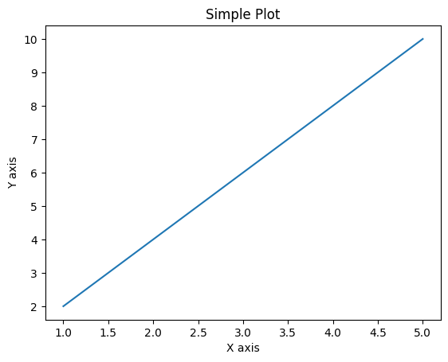
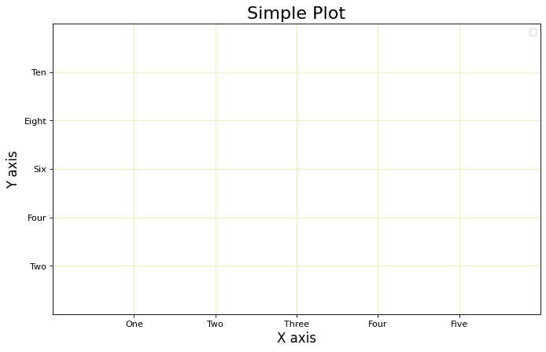

# Matplotlib 

## Introduction

Matplotlib is a popular Python library for creating high-quality data visualizations. It provides an object-oriented API for embedding visualization components into applications. It is often used for creating plots, charts, and graphs. Matplotlib has a wide range of features and can be used for both simple and complex visualizations.


Some interesting facts about Matplotlib that might intrest beginners are:

* Matplotlib was originally created by John D. Hunter in 1999.
* It was named Matplotlib because at the time he was working on it, his cat was named Matplotlib.
* Matplotlib was first released in 2003 and is now maintained by a team of developers.
* Matplotlib is a free and open-source software, which means that anyone can use it and contribute to it.
* Matplotlib was designed to be easy to use and to produce high-quality plots. It has a large number of built-in functions for creating different types of plots.

## Uses of Matplotlib in data analysis

Matplotlib is a powerful library for data visualization and is widely used in data science for exploratory data analysis. It provides a lot of functionalities to create various types of plots, charts, and graphs.

Here are some examples of how Matplotlib can be used in daily analysis of data with more examples:

1. **Line plots**: Line plots are used to show trends in data. For example, to show the change in sales of a product over time, line plot can be used.
2. **Bar plots**: Bar plots are used to show comparisons between different categories. For example, to compare the sales of different products in a company, bar plot can be used.
3. **Scatter plots**: Scatter plots are used to show the relationship between two variables. For example, to show the relationship between the price of a product and its ratings, scatter plot can be used.
4. **Histograms**: Histograms are used to show the distribution of a variable. For example, to show the distribution of the prices of products in a company, histogram can be used.
5. **Box plots**: Box plots are used to show the distribution of a variable and the outliers in the data. For example, to show the distribution of the ratings of different products, box plot can be used.
6. **Subplots**: Subplots are used to show multiple plots in a single figure. For example, to show the sales of different products in a company side-by-side, subplots can be used.
7. **Animations**: Animations are used to show the evolution of a variable over time. For example, to show the evolution of the stock prices of a company over time, animation can be used.
8. **Custom legends**: Custom legends are used to add more information to the plot. For example, to add the names of the products in a bar plot, a custom legend can be used.
```python

# example of matplotlib
import matplotlib.pyplot as plt

x = [1, 2, 3, 4, 5]
y = [2, 4, 6, 8, 10]

plt.plot(x, y)
plt.xlabel('X axis')
plt.ylabel('Y axis')
plt.title('Simple Plot')
plt.show()
```



Here are the keywords attributes used in the above code:

1. `xlabel` : Sets the label of the x-axis.
2. `ylabel` : Sets the label of the y-axis.
3. `title` : Sets the title of the plot.
4. `plot` : Plots the data on a line graph.
5. `show` : Shows the plot.

### Attributes of Matplotlib

Matplotlib has a lot of attributes that can be used to customize the appearance of the plot. Here are some of the important attributes that you should know:

* `figsize`: This attribute sets the size of the figure. It takes a tuple of (width, height) in inches.
* `dpi`: This attribute sets the resolution of the figure. It is the number of pixels per inch.
* `facecolor` and `edgecolor`: These attributes set the background color and border color of the figure, respectively.
* `grid`: This attribute enables or disables the grid in the plot.
* `gridcolor` and `gridalpha`: These attributes set the color and transparency of the grid, respectively.
* `xlim` and `ylim`: These attributes set the x-axis and y-axis limits of the plot.
* `xticks` and `yticks`: These attributes set the locations and labels of the tick marks on the x-axis and y-axis, respectively.
* `titlefontsize` and `labelfontsize`: These attributes set the font size of the title and axis labels, respectively.
* `legend`: This attribute adds a legend to the plot. It takes a dictionary of keyword arguments that can be used to customize the legend.
* `figure`: This attribute returns the figure object, which can be further customized using various methods and attributes.

For example:

```python
# Example of using some of the attributes of Figure
fig = plt.figure(figsize=(10, 6), dpi=80, facecolor='w', edgecolor='k')

# Change the grid color and transparency
ax = fig.add_subplot(111)
ax.grid(True, color='y', alpha=0.3)

# Change the x-axis and y-axis limits
ax.set_xlim([0, 6])
ax.set_ylim([0, 12])

# Change the x-axis and y-axis ticks locations and labels
ax.set_xticks([1, 2, 3, 4, 5])
ax.set_xticklabels(['One', 'Two', 'Three', 'Four', 'Five'])
ax.set_yticks([2, 4, 6, 8, 10])
ax.set_yticklabels(['Two', 'Four', 'Six', 'Eight', 'Ten'])

# Change the font size of the title and axis labels
ax.set_title('Simple Plot', fontsize=20)
ax.set_xlabel('X axis', fontsize=15)
ax.set_ylabel('Y axis', fontsize=15)

# Add a legend to the plot
ax.legend(loc='upper right')

plt.show()
```
