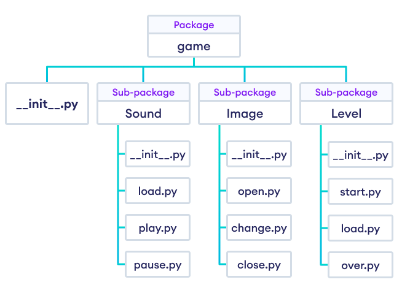

# Unit 5 

## Python packages

A Python package is a way of organizing related modules into a directory hierarchy. It allows you to structure your code more effectively and reuse code across different projects.

### Key Points
1. A package is a collection of Python modules.
2. Packages are directories containing a special file called __init__.py.
3. The __init__.py file can be empty or contain initialization code for the package.
4. Packages can contain sub-packages, forming a hierarchy.


### Step-by-Step Guide

1. **Create the Package Directory**

    First, create a directory for your package. This will be the top-level directory.

    ```bash
    mkdir mypackage
    cd mypackage
    ```

2. **Add an `__init__.py` File**

    Create a file named `__init__.py` inside your package directory. This file can be empty or contain initialization code. It tells Python that this directory should be treated as a package.

    - Open your text editor and create a new file.
    - Save it as `__init__.py` inside the `mypackage` directory.

3. **Create Modules**

    Add your Python modules (files) inside the package directory.

    - Open your text editor and create a new file named `module1.py`.
    - Save it inside the `mypackage` directory.

    Repeat this process to create another file named `module2.py`.

4. **Write Code in Modules**

    Open the module files and add some functions or classes.

    **module1.py**
    ```python
    def greet(name):
        return f"Hello, {name}!"
    ```

    **module2.py**
    ```python
    def farewell(name):
        return f"Goodbye, {name}!"
    ```

5. **Using the Package**

    You can now use your package in a Python script by importing the modules.

    - Create a new Python script (e.g., `test_package.py`) outside the `mypackage` directory.
    - Add the following code to use the functions from the package.

    **test_package.py**
    ```python
    # Importing modules from mypackage
    from mypackage import module1, module2

    # Using functions from the imported modules
    print(module1.greet("Alice"))  # Output: Hello, Alice!
    print(module2.farewell("Bob"))  # Output: Goodbye, Bob!
    ```

### Directory Structure

Your package directory should look like this:

```
mypackage/
    __init__.py
    module1.py
    module2.py
test_package.py
```

### Summary

- **Step 1**: Create a directory for your package.
- **Step 2**: Add an `__init__.py` file inside the directory.
- **Step 3**: Create Python modules (files) inside the directory.
- **Step 4**: Write functions or classes in the modules.
- **Step 5**: Import and use the package in your scripts.

### `__init__.py`

The `__init__.py` file is an essential part of Python packages. Here's a brief explanation:

### Purpose

1. **Package Indicator**: 
   - It tells Python that the directory containing the file should be treated as a package. Without `__init__.py`, Python will not recognize the directory as a package.

2. **Initialization Code**:
   - It can include initialization code for the package. This code runs when the package or its modules are imported.

3. **Controlling Imports**:
   - It can define which modules or sub-packages should be available when the package is imported using the `__all__` list.

### Example

**Directory Structure**:
```
mypackage/
    __init__.py
    module1.py
    module2.py
```

**Contents of `__init__.py`**:
```python
# You can leave it empty
# or include initialization code, for example:
print("mypackage is being imported")

# Or specify which modules to import when using 'from mypackage import *'
__all__ = ['module1', 'module2']
```

**Usage**:
```python
# Importing modules from mypackage
from mypackage import module1, module2

print(module1.greet("Alice"))  # Output: Hello, Alice!
print(module2.farewell("Bob"))  # Output: Goodbye, Bob!
```

### Summary
- **Indicator**: Marks the directory as a package.
- **Initialization**: Can run initialization code.
- **Control Imports**: Defines available modules for import.



### Python Modules

1. **What is a Module?**
   - A module is a file containing Python code (functions, classes, variables) that you can reuse in other Python programs.

2. **Why Use Modules?**
   - Modules help organize code into manageable sections, making it easier to maintain, understand, and reuse.

3. **Creating a Module:**
   - Simply write your code in a `.py` file. For example, `mymodule.py` can contain:
     ```python
     def greet(name):
         return f"Hello, {name}!"
     ```

4. **Using a Module:**
   - Import the module in another script using the `import` statement:
     ```python
     import mymodule
     print(mymodule.greet("Alice"))  # Output: Hello, Alice!
     ```

5. **Built-in and Third-Party Modules:**
   - Python comes with built-in modules (like `math`, `os`), and you can install third-party modules using tools like `pip` (e.g., `requests` for HTTP requests).


`Files created inside the package are modules`


### Python Library Overview

Python's standard library is a comprehensive collection of modules and packages that provide a wide range of functionalities for various programming tasks. Here's a brief overview in Markdown format:

---


The Python standard library provides a solid foundation for building applications across various domains. It is continually maintained and updated, ensuring reliability and compatibility across different Python versions. For specialized tasks, additional third-party libraries and packages are available via the Python Package Index (PyPI) to extend Python's capabilities further.


1. **Specialized Functionality**: Python libraries provide specialized functionalities such as data manipulation (`numpy`, `pandas`), scientific computing (`scipy`), and web development (`Django`, `Flask`).

2. **Enhanced Productivity**: They simplify complex tasks and promote code reuse by offering pre-written modules that integrate seamlessly into Python projects.

3. **Community Contribution**: Python's library ecosystem benefits from extensive community contributions, ensuring a wide range of solutions for diverse programming needs.

4. **Versatility**: Libraries like `requests` simplify HTTP requests, `matplotlib` and `seaborn` facilitate data visualization, and `scikit-learn` supports machine learning tasks.

5. **Industry Adoption**: Python's rich library ecosystem, coupled with its simplicity and versatility, has contributed to its widespread adoption across various industries, from web development and data science to artificial intelligence and automation.

Some Examples

1. **numpy**: Numerical Python library for efficient array operations and mathematical computations, essential for scientific computing and data analysis.

2. **pandas**: Data manipulation and analysis library offering high-level data structures and tools designed to make data analysis fast and easy in Python.

3. **matplotlib**: 2D plotting library for creating publication-quality figures, graphs, and plots, widely used for visualizing data in scientific and engineering disciplines.

4. **scipy**: Library for scientific and technical computing, built on numpy, providing modules for optimization, integration, interpolation, and more advanced mathematical functions.

5. **scikit-learn**: Machine learning library with simple and efficient tools for data mining and analysis, including classification, regression, clustering, and dimensionality reduction algorithms.

6. **requests**: HTTP library for making HTTP requests in Python, providing user-friendly methods to interact with web APIs and websites.

7. **Django**: High-level web framework that encourages rapid development and clean, pragmatic design, used for building scalable web applications with Python.

8. **Flask**: Lightweight and flexible microframework for web development in Python, ideal for small to medium-sized applications and APIs.

9. **TensorFlow**: Open-source machine learning library from Google for numerical computation and machine learning, widely used for building and training neural networks.

10. **PyTorch**: Deep learning framework that accelerates the path from research prototyping to production deployment, known for its ease of use and dynamic computational graph.

### `import library` vs `from library import *`

| Aspect                  | `import library`                         | `from library import *`                     |
|-------------------------|------------------------------------------|--------------------------------------------|
| **What it does**        | Imports the entire module or package.     | Imports all public names from the module into the current namespace. |
| **Usage**               | `import module_name`                     | `from module_name import *`                 |
| **Example**             | `import math`                            | `from math import *`                       |
| **Effect on namespace** | Imports the module with its original name. | Imports all names directly into the current namespace, potentially causing namespace pollution. |
| **Recommended?**        | Generally recommended for better namespace management and avoiding conflicts. | Not recommended due to potential conflicts and readability issues. |
| **Fine-grained control**| Allows selective access to module components using dot notation (`module_name.item`). | Directly imports all names into the current namespace, limiting control over what is imported and potentially hiding local names. |

Using `import library` typically ensures better control and clarity over imported names, while `from library import *` can lead to namespace pollution and potential conflicts, making code harder to understand and maintain.

## Numpy 


  - **Purpose**: numpy is a powerful Python library for numerical computing that provides support for large, multi-dimensional arrays and matrices, along with a collection of high-level mathematical functions to operate on these arrays.

  - **Key Features**: It efficiently implements array operations like addition, multiplication, and slicing, making it essential for tasks involving numerical data and scientific computing.

  - **Performance**: numpy's operations are optimized and executed much faster than traditional Python lists, thanks to its implementation in C.

  - **Usage**: It is widely used in fields such as data science, machine learning, engineering simulations, and more, where fast computation on large datasets is crucial.

  - **Integration**: numpy seamlessly integrates with other libraries like pandas (for data analysis) and matplotlib (for visualization), forming a robust ecosystem for scientific computing in Python.


1. **Creating an Array**:
   ```python
   import numpy as np
   
   # Create a numpy array from a list
   arr = np.array([1, 2, 3, 4, 5])
   print(arr)  # Output: [1 2 3 4 5]
   ```

2. **Performing Arithmetic Operations**:
   ```python
   import numpy as np
   
   # Create two numpy arrays
   arr1 = np.array([1, 2, 3])
   arr2 = np.array([4, 5, 6])
   
   # Element-wise addition
   result = arr1 + arr2
   print(result)  # Output: [5 7 9]
   ```

3. **Matrix Multiplication**:
   ```python
   import numpy as np
   
   # Create two matrices as numpy arrays
   matrix1 = np.array([[1, 2], [3, 4]])
   matrix2 = np.array([[5, 6], [7, 8]])
   
   # Matrix multiplication
   result = np.dot(matrix1, matrix2)
   print(result)
   # Output:
   # [[19 22]
   #  [43 50]]
   ```

4. **Generating Random Numbers**:
   ```python
   import numpy as np
   
   # Generate an array of 5 random integers between 0 and 10
   rand_array = np.random.randint(0, 10, 5)
   print(rand_array)  # Output: [2 5 7 1 9]
   ```

5. **Statistical Operations**:
   ```python
   import numpy as np
   
   # Create an array
   data = np.array([1, 2, 3, 4, 5])
   
   # Calculate mean and standard deviation
   mean_value = np.mean(data)
   std_deviation = np.std(data)
   
   print(f"Mean: {mean_value}, Standard Deviation: {std_deviation}")
   # Output: Mean: 3.0, Standard Deviation: 1.4142135623730951
   ```

### Definition of Python Pip

Python Pip (Pip Installs Packages) is the default package manager for Python, used to install and manage software packages written in Python. It simplifies the process of downloading and installing libraries and frameworks from the Python Package Index (PyPI) and other repositories.

### Examples of Using Pip

1. **Installing a Package**:
   ```bash
   pip install numpy
   ```
   Installs the `numpy` library from PyPI, adding it to your Python environment for use in projects.

2. **Listing Installed Packages**:
   ```bash
   pip list
   ```
   Displays a list of installed Python packages along with their versions, helping manage dependencies and updates.

3. **Upgrading a Package**:
   ```bash
   pip install --upgrade numpy
   ```
   Upgrades the `numpy` library to the latest version available on PyPI, ensuring you have the latest features and bug fixes.

4. **Installing from Requirements File**:
   ```bash
   pip install -r requirements.txt
   ```
   Installs all packages listed in the `requirements.txt` file, useful for setting up a consistent development environment across different machines.

5. **Uninstalling a Package**:
   ```bash
   pip uninstall numpy
   ```
   Removes the `numpy` library from your Python environment, freeing up space and ensuring clean dependencies.

Python Pip simplifies package management in Python, making it essential for installing libraries, managing dependencies, and maintaining consistent environments across different projects.

