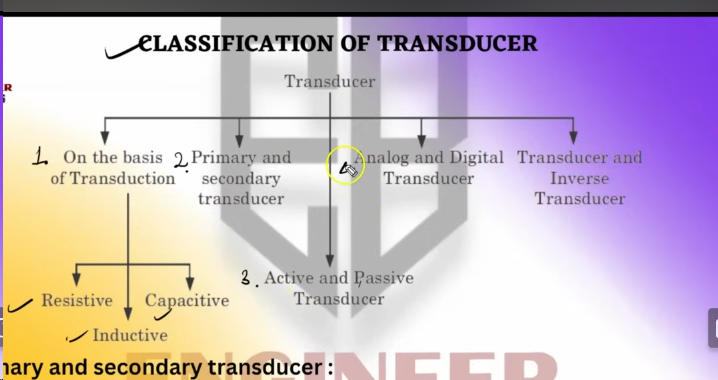

# Si Notes

## Unit 1
### Part 1

- **Define Sensor**\
    Imagine a spy in a movie. Their job is to notice things around them, like if there's danger or something interesting. A sensor is kind of like a tiny spy for machines!

    A sensor is a little device that can detect something in the environment, like light, heat, motion, or even sound. It then sends this information to a computer or another machine.  

    For example, the fingerprint scanner on your phone has a sensor that can feel your fingerprint.  Or, a thermostat has a sensor that can feel the temperature in the room.  Cool, right?  Sensors are everywhere in our gadgets and machines!
- **Define Transducer**\
    A transducer is like a translator for energy. It takes one kind of energy and changes it into another kind.

    Think about a microphone in a karaoke machine. People sing into the microphone, which uses sound waves (energy) from their voice. The microphone translates those sound waves into electrical signals (another kind of energy) that the machine can understand.  

    Then, the machine uses a speaker, which is another kind of transducer. It translates the electrical signals back into sound waves, but much louder, so the whole room can hear your amazing singing!  

    So, transducers are all around us, taking one type of energy and turning it into another, like a secret language converter for machines. 
  
### Based on quantity being measured

- **Active and Passive sensors**

    | Feature | Active Sensor | Passive Sensor |
    |---|---|---|
    | How it works | Creates its own signal and detects the bounce back | Detects natural energy or light from the environment |
    | Needs external power | Yes, to create the signal | No, just uses existing energy |
    | Example | Radar, sonar, motion detector with light | Camera, night vision (uses natural starlight), thermometer |

- Analog and Digital sensors

    | Feature | Analog Sensor | Digital Sensor |
    |---|---|---|
    | Output signal | Continuous electrical signal | Discrete values (usually 0s and 1s) |
    | Accuracy | Can represent very fine gradations | Limited to the number of discrete values |
    | Noise sensitivity | More prone to interference from external factors | Less susceptible to noise |
    | Examples | Thermometer, microphone, light sensor with variable resistance | Fingerprint scanner, pressure sensor with on/off output, camera sensor |

In short, analog sensors are like those who appreciate all the details, while digital sensors are more like "yes or no" kind of folks.  

- Inverse sensors
  

### Factors should be notice while selecting the sensor

- Type of Sensing
- Operaing Principle 
- Power Consumption 
- Accuracy
- Resolution and Range
- Cost

### Classification of Transducer

- Transducer
  - On the basis of Transduction
    - Resistive
  
        These transducers convert a change in resistance into an electrical signal. They work based on the principle that the flow of electricity through a conductor is inversely proportional to its resistance. An example of a resistive transducer is a strain gauge, which is used to measure mechanical strain.
    - Capacitive
  
        Capacitive Transducers: These transducers convert a change in capacitance into an electrical signal. Capacitance is the ability of a device to store electrical charge. Capacitive transducers work by having two electrodes separated by a dielectric material.
        When the distance between the electrodes changes, the capacitance changes. An example of a capacitive transducer is a microphone, which uses a thin diaphragm to convert sound waves into electrical signals.
    - Inductive
        
        These transducers convert a change in inductance into an electrical signal. Inductance is the property of a conductor to oppose changes in current flowing through it. Inductive transducers work by having a coil of wire. When the magnetic field around the coil changes, the inductance changes. An example of an inductive transducer is a metal detector,
        which uses a coil of wire to detect the presence of metal objects.
    
  - Primary and Secondary Transducer
    Primary transducers directly convert a physical quantity into an electrical signal. They are the first element in a transducer chain and are responsible for sensing the physical quantity of interest.
    An example of a primary transducer is a thermocouple, which converts a temperature difference into a voltage
    Secondary transducers do not directly convert a physical quantity into an electrical signal. They take the output of a primary transducer and amplify or modify it in some way. An example of a secondary transducer is an amplifier, which takes a weak electrical signal from a msicrophone and amplifies it into a stronger signal..
  - Active and Passive Transducer
  - Analog and Digital Transducer
  - Transducer and Inverse Transducer
  
### LVDT
---

